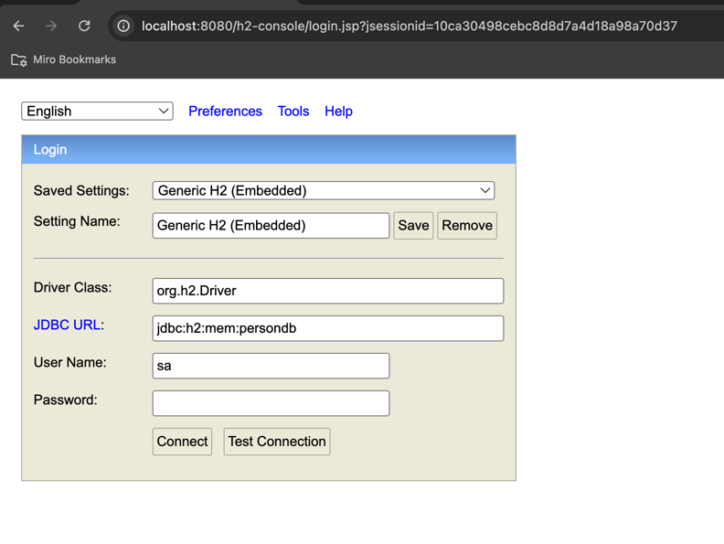

### Demo Spring Boot App

## How to run
Run the Application:

- In IntelliJ IDEA, right-click on MyFrameworkApplication.java and select Run 'SpringBootPlaygroundApplication'
- Using local terminal `mvn spring-boot:run`

## Database
This framework is using H2 in memory database
## Test
- First create the Person object, runs following post request from the terminal
```
curl -X POST \
  -H "Content-Type: application/json" \
  -d '{"name": "Gaurav", "age": 20}' \
  http://localhost:8080/api/persons
```
- Now you can fetch this data using GET
```
curl -X GET http://localhost:8080/api/persons
```

## Access of Database
- Use link `http://localhost:8080/h2-console/` to access the database


- 


